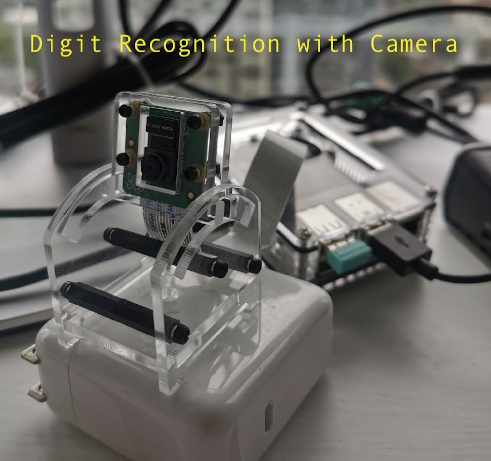
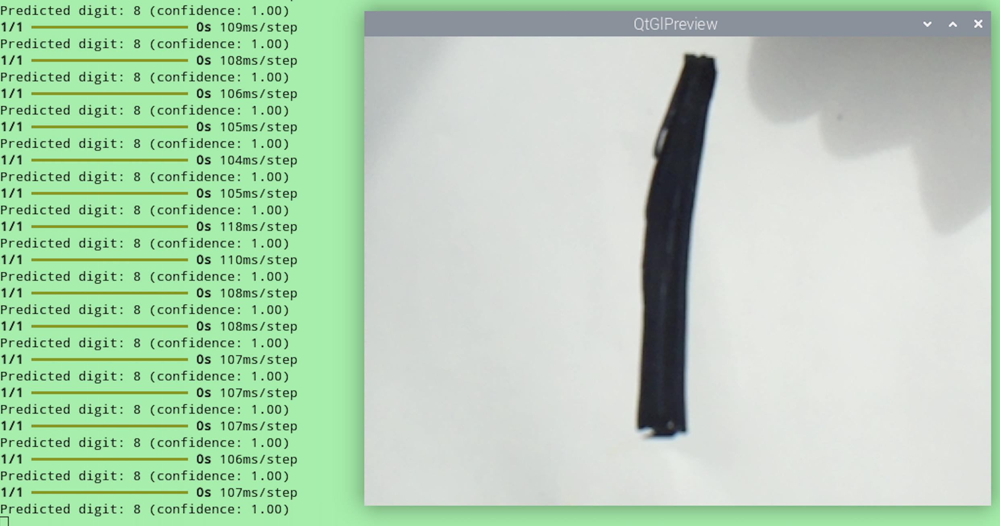
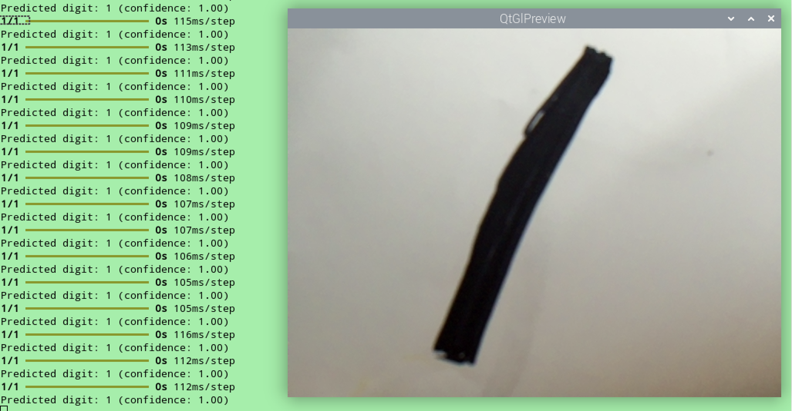
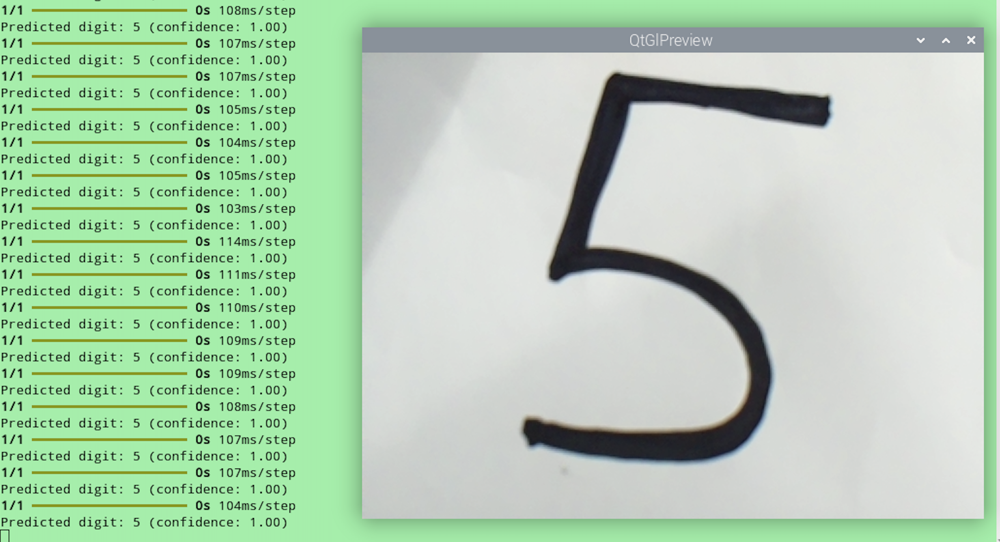
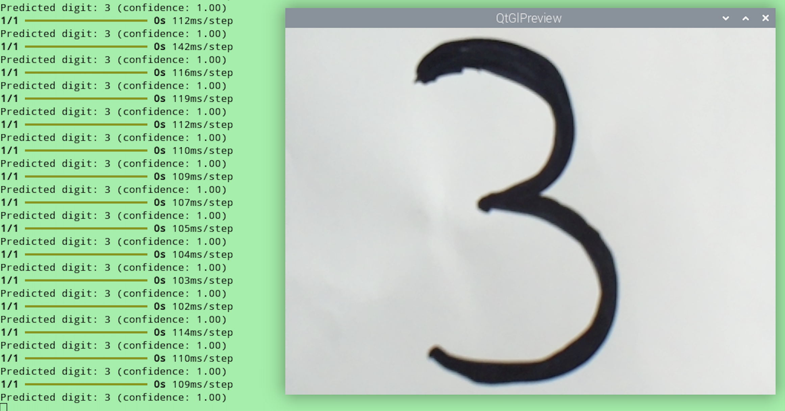

# Digit recognition with mnist and raspberry pi


Initial code taken from repo: `https://github.com/elliebirbeck/tensorflow-digit-recognition` - it is outdated a bit, but serves as a good starting point.

## Requirements

- Some computer that can run python3
- Raspberry Pi with (Pi Camera Module)[https://www.raspberrypi.com/products/camera-module-v2/]

## Installation

- Install Python3 and pip
- Install the Python dependencies `pip install -r requirements.txt`
- Create local venv `python3 -m venv venv`
- Unzip mnist dataset `unzip mnist_dataset/mnist-dataset.zip -d mnist_dataset `
    - I included the dataset in case the original url I used is no longer valid.
    - `source ./venv/bin/activate`
    - run the `test_run.py` to confirm mnist data loader works as expected
- Run the file `python main.py`

## Model Training

`train.py` does the model training based on mnist_dataset training data. Once the model is trained it is safed into a dir that we are going to use to `scp` to our raspberry pi host.

running `python3 train.py` trains the model


```
Iteration 0     | Loss = 0.73475        | Accuracy = 0.78742
Iteration 10    | Loss = 0.06162        | Accuracy = 0.98222
Iteration 20    | Loss = 0.01866        | Accuracy = 0.99480
Iteration 30    | Loss = 0.00659        | Accuracy = 0.99833
Iteration 40    | Loss = 0.00283        | Accuracy = 0.99943

Timing Information:
Time per epoch: 1.58 seconds
Total training time: 1.31 minutes
```

## Test run

once the model is trained the new file will be created - `digit-recognition.keras`, which is the trained model. we can do a test-run with the model and some random image to get a prediction by running `test_model.py`.

we are ready to move to raspberry pi.

## Running on raspberry pi

By this point we need to have raspberry pi setup with os, up and running. To see the digit recognition vizually it's better to run it attached to the monitor (otherwise the preview wont be available).


### Move trained model your machine -> raspberry pi

I suggest you use either usb stick or `scp` to move your pre-trained `digit-recognition.keras` model to raspberry pi, rather than training on it (it would take you more time).

### Note on python modules

 - I git pulled this repo to my raspberry pi and setup venv locally with `python3 -m venv venv ----system-site-packages`. 
 - `pip install -r requirements.txt` to get all python modules
 - to get `picamera2` we need to install it through `apt get` and not pip, for that we needed the global packages flag
 - `sudo apt install -y python3-picamera2` to get the module. more on that [here](https://datasheets.raspberrypi.com/camera/picamera2-manual.pdf)
 - in venv, we need to use global version of `numpy` - `pip uninstall numpy` to use the global version.

 That should be all, though if any errors be prepared to debug

 ## Model Run

 on raspberry pi run `python3 start_camera.py` - which will open the preview screen and start the model. You can now play with it :)

 there is an option to save the processed frames, which were fed to the model - good option for debugging.
 uncomment the following line `# save_processed_img(img, digit)`


## Post Notes

I hand-drawn all my digits on a white piece of paper with black sharpie. This paper was then placed in front of the camera, which took the frames and passed them to the model. If there was a match and model classified an image as having a image, the result would be outputted to the terminal and (optionally) frame saved.

randomly found out the mnist data-set is biased for digit 1s tilted 30-45 degress to the right - otherwise digits arent recognized.

I went through a few phazes of pre-processing and results were improved as the pre-processing improved.

### Initial test runs

-  : classified as 9
- : classified as 9

### Update frame processing using CV python module

Most of the updates were suggested by LLM and had to deal with finding the contours of the digit, cropping the digit itself, shrinking it to 20x20 and padding with extra pixels on the edges to make the digit centered + increasing the contour width to have better changes of recognizing "1"s.

- : classified as 1
-  classified as 1
- : classified as 6
- : classified as 7
- : classified as 9

### Run Screenshots



Found out this specific training has hard time recognizing 1s unless they are tilted




