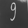

# Digit Recognition with MNIST and Raspberry Pi


🧠 This project uses a Raspberry Pi setup to run a neural network trained to recognize handwritten digits (0–9) from the MNIST dataset, and classify digits from a live video stream.

I skipped the model training phase and used this as a starting point: [`elliebirbeck/tensorflow-digit-recognition`](https://github.com/elliebirbeck/tensorflow-digit-recognition), modifying it with help from LLMs to work with the current version of TensorFlow.

This repo is **not** a tutorial on how to train a model, but rather a practical guide on how to *use* one—specifically, the setup I used and the steps I took to make it work.

---

## Requirements

- A computer that can run Python 3
- Raspberry Pi with [Camera Module](https://www.raspberrypi.com/products/camera-module-v2/)

---

## Installation

1. Install Python 3 and `pip`
2. Install Python dependencies:
   ```bash
   pip install -r requirements.txt
   ```
3. Create a local virtual environment:
   ```bash
   python3 -m venv venv
   source ./venv/bin/activate
   ```
4. Unzip the MNIST dataset:
   ```bash
   unzip mnist_dataset/mnist-dataset.zip -d mnist_dataset
   ```
   > The dataset is included in case the original URL becomes unavailable.
5. Run `test_run.py` to confirm that the MNIST data loader works as expected.
6. Start the app:
   ```bash
   python main.py
   ```

---

## Model Training

The `train.py` script handles model training using the data in `mnist_dataset/`. Once training completes, the model is saved into a directory that we’ll use to `scp` it to the Raspberry Pi.

To train the model:
```bash
python3 train.py
```

Expected output:
```
Iteration 0     | Loss = 0.73475        | Accuracy = 0.78742
Iteration 10    | Loss = 0.06162        | Accuracy = 0.98222
Iteration 20    | Loss = 0.01866        | Accuracy = 0.99480
Iteration 30    | Loss = 0.00659        | Accuracy = 0.99833
Iteration 40    | Loss = 0.00283        | Accuracy = 0.99943

Timing Information:
Time per epoch: 1.58 seconds
Total training time: 1.31 minutes
```

---

## Test Run

Once the model is trained, a new file named `digit-recognition.keras` will be created. This is your trained model.

You can test it on a random image using:
```bash
python test_model.py
```

Once verified, you're ready to move the model to your Raspberry Pi.

---

## Running on Raspberry Pi

Make sure your Raspberry Pi is up and running with the OS installed. To visualize the digit recognition, it's best to connect it to a monitor (the preview won't be visible over SSH).

### Move the Trained Model to the Pi

Use either a USB stick or `scp` to copy the trained `digit-recognition.keras` model to the Pi. **Avoid training the model directly on the Pi**, as it would take much longer.

### Python Module Setup

- Clone this repo onto your Raspberry Pi
- Set up the virtual environment:
  ```bash
  python3 -m venv venv --system-site-packages
  source venv/bin/activate
  ```
- Install dependencies:
  ```bash
  pip install -r requirements.txt
  ```

#### Special Notes

- Install `picamera2` using `apt`, **not pip**:
  ```bash
  sudo apt install -y python3-picamera2
  ```
  [More info in the official manual](https://datasheets.raspberrypi.com/camera/picamera2-manual.pdf)

- You may need to **use the global version of NumPy**:
  ```bash
  pip uninstall numpy
  ```

That should be it — but be ready to debug if needed!

---

## Running the Model

To start the model on the Raspberry Pi:
```bash
python3 start_camera.py
```

This will open a preview window and begin digit classification.

> Tip: To save the processed frames that are passed to the model (for debugging), uncomment the line:
> ```python
> # save_processed_img(img, digit)
> ```

---

## Notes

I hand-drew all digits on white paper using a black Sharpie. The paper was held in front of the camera, which captured frames and passed them to the model.

If the model detected a digit, the prediction was printed to the terminal, and the corresponding frame was optionally saved.

### Dataset Bias

Random observation: the MNIST dataset seems biased toward **digit 1s tilted 30–45° to the right**. If the 1s aren’t tilted, they are often not recognized correctly.

### Preprocessing Experiments

I went through several phases of preprocessing — the results improved as preprocessing got better.

#### Initial Test Runs

-  — classified as 9  
-  — classified as 9

#### Improved Frame Processing with OpenCV

Most improvements were suggested by LLMs and focused on:
- Detecting contours
- Cropping the digit
- Resizing to 20×20
- Padding to center the digit
- Increasing contour thickness (to help with digit “1” recognition)

Results:

-  — classified as 1  
-  — classified as 1  
-  — classified as 6  
-  — classified as 7  
-  — classified as 9

---

## Screenshots

  
This particular model struggled to recognize straight "1"s unless they were tilted.

  
  
